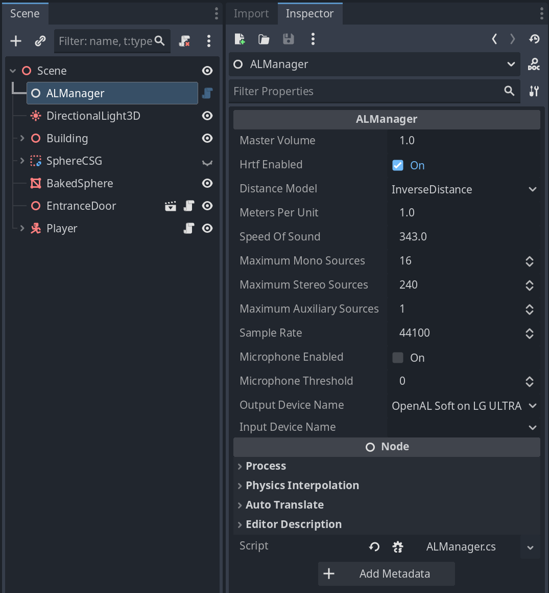

# OpenAL Plugin for Godot

This plugin provides custom nodes for using OpenAL Soft directly in Godot, bypassing Godot's built-in audio system.

## Setup Instructions

### 1. Enable the Plugin

1. Copy the `godot_openal` folder to the `your_game/addons/` folder
2. Open Godot
3. Ensure your C# solution is created: `Project > Tools > C# > Create C# Solution`
4. Enable `godot_openal` in `Project > Project Settings > Plugins`

If you get the below error, make sure you've created a C# solution first (step 3 above):

```
godot_openal: No C# solution found. Please create a C# solution first (Project → Tools → C# → Create C# Solution)
```

After creating a C# project, disable and enable the `godot_openal` plugin in `Project > Project Settings > Plugins`.

#### Automatic Dependency Setup

The plugin setup script in `addons/godot_openal/plugin.gd` will perform some setup logic for you. First, it will add this to your project's `.csproj` file:

```xml
<PropertyGroup>
    <!-- Allow unsafe code (required for buffering audio data to OpenAL Soft) -->
    <AllowUnsafeBlocks>true</AllowUnsafeBlocks>
</PropertyGroup>

<ItemGroup>
    <!-- C# bindings for OpenAL Soft -->
    <PackageReference Include="openal_soft_bindings" Version="1.0.3" />

    <!-- C# bindings for OpenAL Soft -->
    <PackageReference Include="NAudio" Version="2.2.1" />
    <PackageReference Include="BunLabs.NAudio.Flac" Version="2.0.1" />
    <PackageReference Include="NVorbis" Version="0.10.5" />
</ItemGroup>
```

Second, it will copy `soft_oal.dll` to your project root, which is where your project searches for `.dll` files when it runs.

### 2. Create an ALManager
In your main scene, add an `ALManager` node:



The `ALManager` node overrides Godot's inbuilt audio system, and has settings for controlling volume, enabling HRTF, output/input device, etc.

To verify your installation worked, the Output Device Name field should be populated in the inspector

### 2. Play a Sound

Create an `ALSource3D` node and set its `Sound Name` to the path of the sound in the `res://audio` folder. To play the sound, invoke `.Play()` on the node via GDScript or C#.

If your sound files live in a different folder, you can set a custom path using the `audio/openal_sound_folder.custom` setting:

